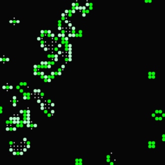
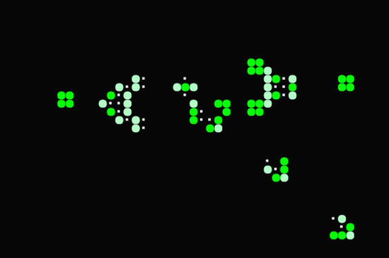

# Practical Work - Programming Topics

> [!CAUTION]
> 2 grades are required in the subject, the practical work (PW) must be submitted and defended individually in parts 1 and 2 before the midterm exam. The defense will be individual, and you must demonstrate mastery of the tools in general and the practical work in particular. For the PW to be archived, it must be submitted by the deadline indicated by the teachers in the following format: `ID_LASTNAME_FIRSTNAME_PW.zip`, e.g., `41127133_PEREZ_MARIA_PIA_PW.zip`. Note that it is a `.zip`, not `.rar` or `.7z`, respect the submission format. The PW as a suffix indicates it is practical work. Attach the statement and remove the `bin` and `obj` folders, as you are sharing programs, and for obvious reasons, the servers will delete compressed files containing binaries or executables.

## Necessary knowledge

-   **Part 1**: Structured programming and arrays.
-   **Part 2**: Dynamic memory.
-   **Part 3**: Files.

## General guidelines and statement

Develop the following work in groups of 3 to 5 people. Submission and defense are mandatory. Parts 1 and 2 will be required to take the midterm exam. Keep in mind that the solution must be executable in the laboratories of the [UNLaM](https://www.unlam.edu.ar/), so it must be compatible with the **MinGW 64-bit** compiler. For richer and lag-free visualization, it is recommended to use the [SDL (Simple DirectMedia Layer)](https://www.libsdl.org/) library, the teachers will provide a project with the library included. You will only need to know the functions that allow drawing the elements of the work (_Illustration 1_).

> Illustration 1

Conway's Game of Life is a one-player game designed by British mathematician [John Horton Conway](https://en.wikipedia.org/wiki/John_Horton_Conway) in 1970. It is a one-player game where the evolution is determined by the initial state. A series of very simple rules will determine the overall evolution of the system.

The playing field will be an **NxM** board where each position represents a cell. Each cell has 8 neighboring positions. Cells can be alive/dead, and the following rules determine the cellular behavior in each turn:

-   Born: If a dead cell has exactly 3 living neighboring cells, it is "born" (i.e., it will be alive in the next turn).
-   Dies: A living cell can die from overpopulation or isolation.
    -   Overpopulation: If it has more than three neighbors.
    -   Isolation: If it has only one neighbor or none.
-   Lives: A cell remains alive if it has 2 or 3 neighbors.

### For more information:

-   [https://en.wikipedia.org/wiki/Conway%27s_Game_of_Life](https://en.wikipedia.org/wiki/Conway%27s_Game_of_Life)
-   [https://www.youtube.com/watch?v=2ssnMkJFqbA](https://www.youtube.com/watch?v=2ssnMkJFqbA)

## Part 1

### Part A

Design and test in library-type files `matrices.h` and `matrices.c` the necessary functions to initialize matrices with a known pattern (see _Illustration 2 - Glider Gun_), for example:

-   Glider
-   Toad
-   Pulsar
-   Glider Gun

You can explore known patterns from online sources.
Design and implement functions that allow determining the next state of a cell based on its current state and its neighbors.
Use the patterns to verify correct functionality. Develop the solution to work with different matrix sizes, even if the size is defined at compile time.

### Part B

Draw the game on screen using **SDL** (the teachers will provide the template). You don’t have to follow the order of parts **A** and **B**; do it however feels most comfortable. Do you prefer to start with **SDL** to get a better visualization of what is happening? Great, do it that way. Do you prefer to test the cell logic via the console and then incorporate the visualization? Excellent, do it that way. Part of the learning process is understanding that these are different problems and how to tackle them. Choose the alternative that feels most comfortable.

> Illustration 2 - Glider Gun

## Part 2

Did you observe the largest matrix you can work with? Why does this happen?

Add new functions that allow working with matrices in dynamic memory, receive the matrix size via command line, and never use **VLA (Variable Length Array)**. In part 2, the matrix size will be dynamic and known at runtime.

## Part 3

Add the ability to read the system’s general state from text files before starting.
