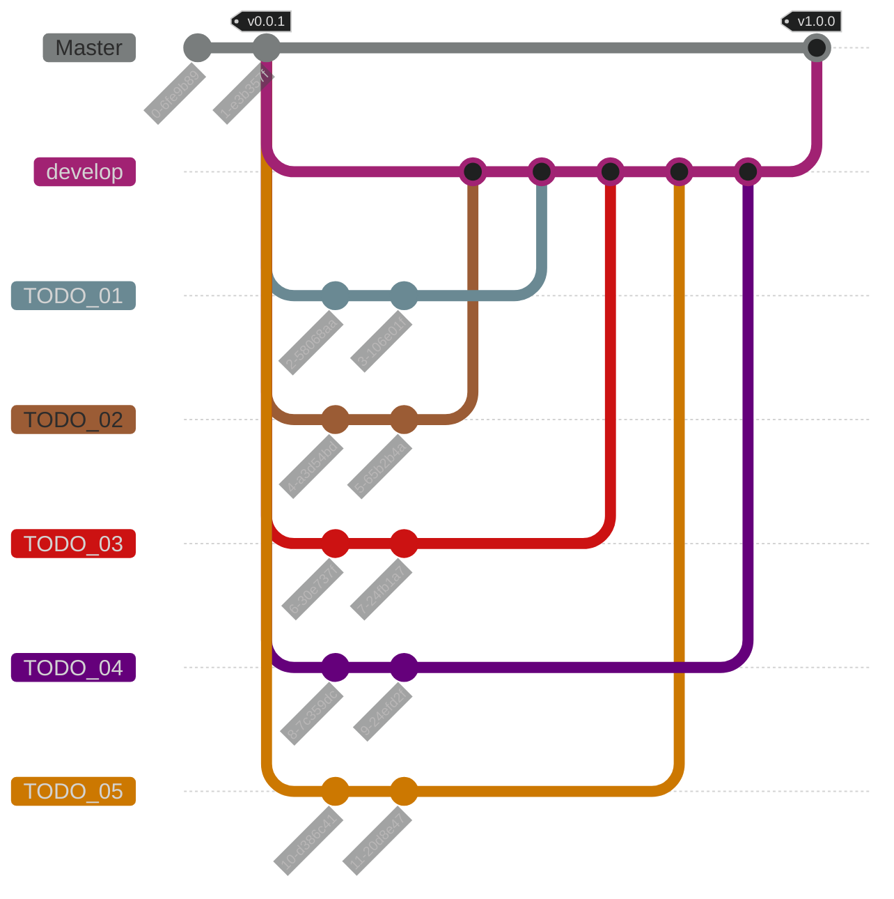

<h1 align="center">
    Trabajo Práctico de C [2024]
</h1>

<h4 align="center">
    Repositorio del trabajo práctico para la materia Tópicos de Programación - <a href="https://www.unlam.edu.ar/">UNLaM</a> (Universidad Nacional de La Matanza).
</h4>

<p align="center">
    <a href="#----resumen">Resumen</a> •
    <a href="#----caracteristicas">Características</a> •
    <a href="#----instalacion">Instalación</a> •
    <a href="#----problemas-conocidos">Problemas conocidos</a> •
    <a href="#----estructura-de-la-aplicación">Estructura de la aplicación</a> •
    <br>
    <a href="#----flujo-de-trabajo-del-equipo">Flujo de trabajo del equipo</a> •
    <a href="#----equipo-de-desarrollo">Equipo de desarrollo</a> •
    <a href="#----material-adicional">Material adicional</a> •
    <a href="#----licencia">Licencia</a> •
    <a href="#----agradecimientos">Agradecimientos</a>
</p>

<h4 align="center">
    <a href="../../../README.md">[ Versión en Inglés ]</a>
</h4>

<p align="center">
    <a href="#">
        
    </a>
</p>

<p align="center">
    <strong><a href="#" target="_blank">(video demostrativo)</a></strong>
</p>

## Resumen

Este repositorio contiene el trabajo práctico de la materia Tópicos de Programación de la [Universidad Nacional de La Matanza (UNLaM)](https://www.unlam.edu.ar/). El trabajo práctico consiste en el desarrollo del [Juego de la Vida de Conway](https://en.wikipedia.org/wiki/Conway%27s_Game_of_Life) utilizando el lenguaje de programación C y la librería [Simple DirectMedia Layer (SDL)](https://www.libsdl.org/) para la interfaz gráfica.

## Características

-   Integración continua con [GitHub Actions](https://docs.github.com/es/actions)
-   Documentación del código utilizando la sintaxis de [Doxygen](https://www.doxygen.nl/)

## Instalación

1. Clona el repositorio en tu dispositivo e instala el IDE [CodeBlocks](https://www.codeblocks.org/) con MinGW.

2. Abre los archivos [src.cbp](./src/src.cbp) (proyecto principal) y [libs.cbp](./libs/libs.cbp) (proyecto con las librerías) con la aplicación CodeBlocks. Estos archivos se encuentran dentro del repositorio clonado.

3. Selecciona el proyecto [libs.cbp](./libs/libs.cbp) (proyecto con las librerías) y compílalo en modo Release y en modo Debug.

4. Selecciona el proyecto [src.cbp](./src/src.cbp) (proyecto principal) y ejecútalo en modo Release para disfrutar del Juego de la Vida de Conway.

## Problemas conocidos

| Problema                                                              | Solución                                                                                                                                                                                                                                                                                                                                                                                                                                                                                     |
| :-------------------------------------------------------------------- | :------------------------------------------------------------------------------------------------------------------------------------------------------------------------------------------------------------------------------------------------------------------------------------------------------------------------------------------------------------------------------------------------------------------------------------------------------------------------------------------- |
| **Proyecto [src.cbp](./src/src.cbp) (proyecto principal) no compila** | _Selecciona el proyecto [libs.cbp](./libs/libs.cbp) (proyecto con las librerías) y compílalo en modo Release y en modo Debug. Luego, selecciona el proyecto [src.cbp](./src/src.cbp) (proyecto principal), haz clic derecho sobre este, elige la opción `Build Options` y ve a la pestaña `Linker settings`. Allí, añade los archivos `libs.a` que se encuentran dentro de las carpetas `libs/bin/Debug` y `libs/bin/Release`. Finalmente vuelve a intentar compilar el proyecto principal._ |

## Estructura de la aplicación

```plaintext
C-Practical-Work-2024/
│
├── .github/
│   ├── statics/
│   │   ├── illustration-01.png
│   │   ├── illustration-02.png
│   │   └── preview.png
│   │
│   ├── translations/
│   │   ├── en/
│   │   │   ├── documentation.md
│   │   │   └── requirements.md
│   │   │
│   │   └── es/
│   │       ├── README.md
│   │       ├── documentation.md
│   │       └── requirements.md
│   │
│   └── workflows/
│       └── format-code.yml
│
├── src/
│   ├── main.c
│   ├── src.cbp
│   │
│   └── statics/
│       └── initial-state.txt
|
├── libs/
│   ├── libs.cbp
│   ├── macros.h
│   ├── main.h
│   ├── utilities.c
│   ├── utilities.h
|   |
│   └── cells/
│       ├── constructors.c
│       ├── constructors.h
│       ├── methods.c
│       └── methods.h
|
├── .clang-format
├── .gitignore
├── LICENSE
└── README.md
```

-   **[.github](./.github)** - Archivos relacionados a la documentación de la aplicación y a la integración continua.

    -   **[statics](./.github/statics)** - Archivos estáticos (imágenes, videos, diagramas, etc.).
    -   **[translations](./.github/translations)** - Traducciones de los archivos con extensión `.md` (Markdown).
    -   **[workflows](./.github/workflows)** - Flujos de trabajo de las GitHub Actions.

-   **[src](./src)** - Proyecto principal de la aplicación.

    -   **[main.c](./src/main.c)** - Archivo de ejecución principal.
    -   **[src.cbp](./src/src.cbp)** - Archivo de configuración del proyecto.

    -   **[statics](./src/statics)** - Archivos (imágenes, videos, diagramas, etc.).

        -   **[initial-state.txt](./src/statics/initial-state.txt)** - Archivo con el estado inicial de la aplicación.

-   **[libs](./libs)** - Proyecto con las librerías necesarias para la ejecución del proyecto principal de aplicación.

    -   **[libs.cbp](./libs/libs.cbp)** - Archivo de configuración del proyecto.
    -   **[macros.h](./libs/macros.h)** - Archivo con las macros esenciales del proyecto.
    -   **[main.h](./libs/main.h)** - Archivo que indexa todos los archivos `.h` del proyecto.
    -   **[utilities.c](./libs/utilities.c)** - Archivo con el desarrollo de los prototipos de función presentes en `utilities.h`.
    -   **[utilities.h](./libs/utilities.h)** - Archivo con las estructuras y los prototipos de función de uso común.

    -   **[cells](./libs/cells)** - Funciones y estructuras de las entidades `células`.

        -   **[constructors.c](./libs/cells/constructors.c)** - Archivo con el desarrollo de los prototipos de función presentes en `constructors.h`.
        -   **[constructors.h](./libs/cells/constructors.h)** - Archivo con las estructuras y los prototipos de función relacionados a la creación de células.
        -   **[methods.c](./libs/cells/methods.c)** - Archivo con el desarrollo de los prototipos de función presentes en `methods.h`.
        -   **[methods.h](./libs/cells/methods.h)** - Archivo con los prototipos de función relacionados a los métodos de las células.

-   **[.clang-format](./.clang-format)** - Archivo de configuración de la herramienta de formateo de código `clang-format`.
-   **[.gitignore](./.gitignore)** - Archivo de configuración de Git para evitar el rastreo de archivos no deseados.
-   **[LICENSE](./LICENSE)** - Licencia del proyecto.
-   **[README.md](./README.md)** - Archivo Markdown con la documentación general de la aplicación y del repositorio.

## Flujo de trabajo del equipo



### Etiquetas

-   `vMAYOR.MINOR.PATCH`: Esta etiqueta indica la publicación de un Release del trabajo práctico siguiendo el [Semantic Versioning](https://semver.org/), y solo estará presente en las confirmaciones de la rama `Master`.

### Ramas

-   `Master`: Rama que contiene las versiones estables del trabajo práctico.

-   `develop`: Rama que alberga las versiones en desarrollo del trabajo práctico, donde los miembros del equipo incorporarán nuevos cambios (confirmaciones).

> Las demás ramas son ficticias y representan las contribuciones individuales que cada miembro hará sobre la rama `develop`.

## Equipo de desarrollo

-   [TODO_01](TODO)
-   [TODO_02](TODO)
-   [TODO_03](TODO)
-   [TODO_04](TODO)
-   [TODO_05](TODO)

## Material adicional

-   [Documentación del código](./documentation.md)
-   [Requerimientos del trabajo práctico](./requirements.md)

## Licencia

Este repositorio está bajo la [Licencia MIT](../LICENSE). Para más información sobre lo que está permitido hacer con el contenido de este repositorio, visita [choosealicense.com](https://choosealicense.com/licenses/).

## Agradecimientos

Agradecemos a los docentes de la [UNLaM](https://www.unlam.edu.ar/) de la asignatura de Programación por su apoyo y guía.
