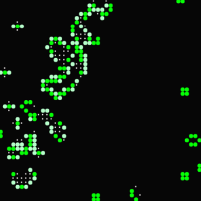

# Trabajo práctico - Tópicos de programación

> [!CAUTION]
> Se requieren 2 notas en la asignatura, el TP debe ser entregado y defendido individualmente en sus partes 1 y 2 antes del examen parcial. La defensa será individual y usted deberá mostrar dominio sobre las herramientas en general y el trabajo práctico en particular. Para que el TP pueda ser archivado debe ser entregado obligatoriamente en la fecha indicada por los docentes y con el siguiente formato: `DNI_APELLIDO_NOMBRE_TP.zip`, ejemplo `41127133_PEREZ_MARIA_PIA_TP.zip`. Observe que es un `.zip`, no es `.rar` ni `.7z` respete la forma de entrega. La TP como sufijo indica que es el trabajo práctico. Adjunte el enunciado y elimine las carpetas `bin` y `obj`, está compartiendo programas y por obvias razones los servidores eliminarán comprimidos que contengan binarios o ejecutables.

## Conocimientos necesarios

-   **Parte 1**: Programación estructurada y matrices.
-   **Parte 2**: Memoria dinámica.
-   **Parte 3**: Archivos.

## Generalidades y enunciado

Desarrollar el siguiente trabajo en grupos de entre 3 a 5 personas. La entrega y defensa es obligatoria. Las partes 1 y 2 serán requisito para poder rendir el parcial. Tenga en cuenta que la solución debe poder ejecutarse en los laboratorios de la [UNLaM](https://www.unlam.edu.ar/) por tanto debe ser compatible con el compilador **MinGW 64 bits**. Para obtener una visualización más rica y sin "lags" o desfases se recomienda usar la biblioteca [SDL (Simple DirectMedia Layer)](https://www.libsdl.org/), los docentes entregarán un proyecto con la biblioteca incorporada. De esta biblioteca será necesario únicamente conocer las funciones que permitan dibujar los elementos del trabajo (_Ilustración 1_).

> Ilustración 1

El Juego de la Vida de Conway es un juego de un jugador diseñado por el matemático británico [John Horton Conway](https://es.wikipedia.org/wiki/John_Horton_Conway) en el año 1970. Es un juego de un jugador donde la evolución viene dada por el estado inicial. Una serie de muy simples reglas determinaran la evolución general del sistema.

El campo de juego será un tablero de **NxM** donde cada posición representa una célula. Cada célula contiene 8 posiciones fronterizas o vecinas. Las células pueden estar vivas/muertas, las siguientes reglas determinan el comportamiento celular en cada turno:

-   Nace: Si una célula muerta tiene exactamente 3 células vecinas vivas "nace" (es decir, al turno siguiente estará viva).
-   Muere: Una célula viva puede morir por sobrepoblación o aislamiento.
    -   Sobrepoblación: Si tiene más de tres vecinos alrededor.
    -   Aislamiento: Si tiene solo un vecino alrededor o ninguno.
-   Vive: Una célula se mantiene viva si tiene 2 o 3 vecinos a su alrededor.

### Para más información:

-   [https://es.wikipedia.org/wiki/Juego_de_la_vida](https://es.wikipedia.org/wiki/Juego_de_la_vida)
-   [https://www.youtube.com/watch?v=2ssnMkJFqbA](https://www.youtube.com/watch?v=2ssnMkJFqbA)

## Parte 1

### Parte A

Diseñe y pruebe en archivos tipo biblioteca `matrices.h` y `matrices.c` las funciones necesarias para poder inicializar matrices con un patrón conocido (ver _Ilustración 2 - Cañón de planeadores_), por ejemplo:

-   Planeador
-   Sapo
-   Pulsar
-   Cañón de planeadores

Puede explorar patrones conocidos en fuentes de internet.
Diseñe e implemente las funciones que le permitan saber el próximo estado de una célula en función de su estado actual y sus vecinos.
Utilice los patrones para verificar el correcto funcionamiento. Desarrolle la solución para que pueda trabajar con diferentes matrices, aunque el tamaño sea definido en tiempo de compilación.

### Parte B

Dibuje en pantalla utilizando **SDL** el juego funcionando (Los docentes proveerán la plantilla). No es necesario que respete el orden de las partes **A** y **B**, hágalo como se sienta mas cómodo. ¿Prefiere comenzar con **SDL** para así tener una visualización mejor de lo que esta sucediendo?, excelente, hágalo de esa manera. ¿Prefiere probar vía consola que funcione perfectamente la lógica de las células y luego incorporar la problemática de visualización? Excelente, hágalo de esa manera. Parte del aprendizaje es entender que son problemas distintos y cómo encararlos. Busque la alternativa que más cómoda le resulte.

> Ilustración 2 - Cañón de planeadores

## Parte 2

¿Observó cual es la matriz mas grande que con la que puede trabajar? ¿Porque ocurre?

Incorpore nuevas funciones que permitan trabajar con matrices en memoria dinámica, reciba el tamaño de la matriz por la línea de comando y nunca utilice **VLA (Variable Length array)**. En esta parte 2 el tamaño de la matriz será dinámico y se conocerá en tiempo de ejecución.

## Parte 3

Incorpore la posibilidad y leer de archivos de texto el estado general del sistema antes de comenzar.
