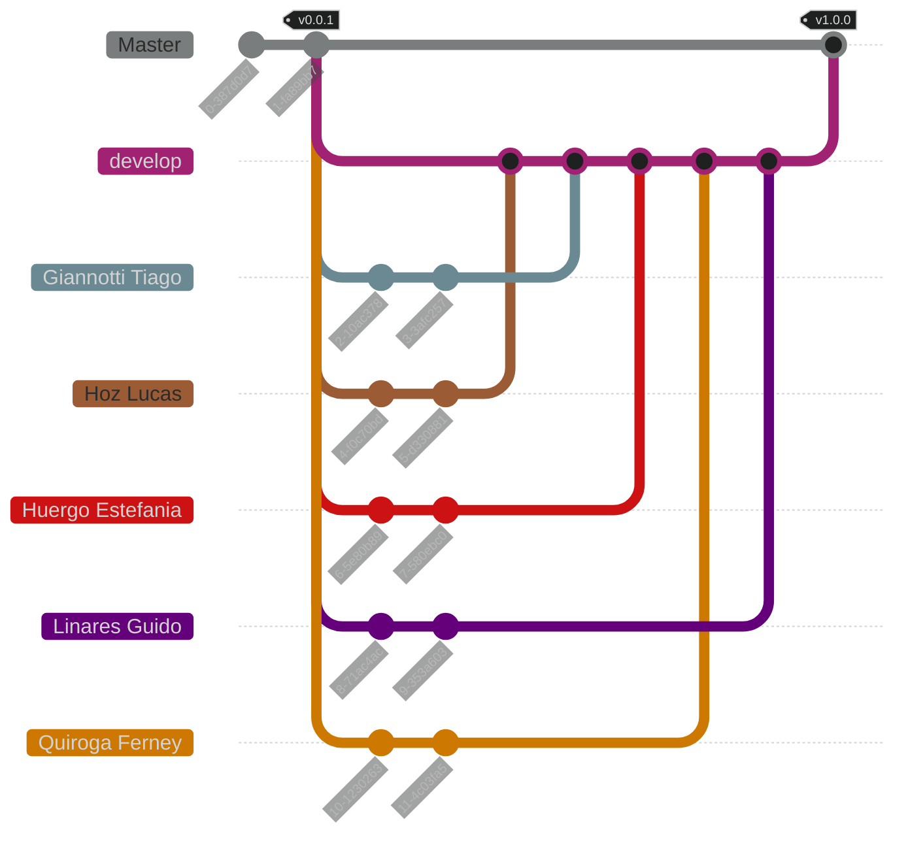

<h1 align="center">
    C Practical Work [2024]
</h1>

<h4 align="center">
    Repository for the practical work of the Programming Topics course - <a href="https://www.unlam.edu.ar/">UNLaM</a> (National University of La Matanza).
</h4>

<p align="center">
    <a href="#----summary">Summary</a> •
    <a href="#----features">Features</a> •
    <a href="#----installation">Installation</a> •
    <a href="#----known-issues">Known Issues</a> •
    <a href="#----application-structure">Application Structure</a> •
    <br>
    <a href="#----team-workflow">Team Workflow</a> •
    <a href="#----development-team">Development Team</a> •
    <a href="#----additional-material">Additional Material</a> •
    <a href="#----license">License</a> •
    <a href="#----acknowledgments">Acknowledgments</a>
</p>

<h4 align="center">
    <a href="./.github/translations/es/README.md">[ Spanish Version ]</a>
</h4>

<p align="center">
    <a href="#">
        
    </a>
</p>

<p align="center">
    <strong><a href="#" target="_blank">(demonstration video)</a></strong>
</p>

## Summary

This repository contains the practical work for the Programming Topics course at the [National University of La Matanza (UNLaM)](https://www.unlam.edu.ar/). The practical work involves the development of [Conway's Game of Life](https://en.wikipedia.org/wiki/Conway%27s_Game_of_Life) using the C programming language and the [Simple DirectMedia Layer (SDL)](https://www.libsdl.org/) library for the graphical interface.

## Features

-   Continuous integration with [GitHub Actions](https://docs.github.com/en/actions)
-   Code documentation using [Doxygen](https://www.doxygen.nl/) syntax

## Installation

1. Clone the repository to your device and install the [CodeBlocks](https://www.codeblocks.org/) IDE with MinGW.

2. Open the files [src.cbp](./src/src.cbp) (main project) and [libs.cbp](./libs/libs.cbp) (library project) with the CodeBlocks application. These files are located within the cloned repository.

3. Select the [libs.cbp](./libs/libs.cbp) project (library project) and compile it in Release mode and Debug mode.

4. Select the [src.cbp](./src/src.cbp) project (main project) and run it in Release mode to enjoy Conway's Game of Life.

## Known Issues

| Issue                                                       | Solution                                                                                                                                                                                                                                                                                                                                                                                                         |
| :---------------------------------------------------------- | :--------------------------------------------------------------------------------------------------------------------------------------------------------------------------------------------------------------------------------------------------------------------------------------------------------------------------------------------------------------------------------------------------------------- |
| **[src.cbp](./src/src.cbp) (main project) doesn't compile** | _Select the [libs.cbp](./libs/libs.cbp) project (library project) and compile it in Release mode and Debug mode. Then, select the [src.cbp](./src/src.cbp) project (main project), right-click on it, choose `Build Options`, and go to the `Linker settings` tab. There, add the `libs.a` files located in the `libs/bin/Debug` and `libs/bin/Release` folders. Finally, try compiling the main project again._ |

## Application Structure

```plaintext
C-Practical-Work-2024/
│
├── .github/
│   ├── statics/
│   │   ├── illustration-01.png
│   │   ├── illustration-02.png
│   │   └── preview.png
│   │
│   ├── translations/
│   │   ├── en/
│   │   │   ├── documentation.md
│   │   │   └── requirements.md
│   │   │
│   │   └── es/
│   │       ├── README.md
│   │       ├── documentation.md
│   │       └── requirements.md
│   │
│   └── workflows/
│       └── format-code.yml
│
├── src/
│   ├── main.c
│   ├── src.cbp
│   │
│   └── statics/
│       └── initial-state.txt
|
├── libs/
│   ├── libs.cbp
│   ├── macros.h
│   ├── main.h
│   ├── utilities.c
│   ├── utilities.h
|   |
│   └── cells/
│       ├── constructors.c
│       ├── constructors.h
│       ├── methods.c
│       └── methods.h
|
├── .clang-format
├── .gitignore
├── LICENSE
└── README.md
```

-   **[.github](./.github)** - Files related to the application's documentation and continuous integration.

    -   **[statics](./.github/statics)** - Static files (images, videos, diagrams, etc.).
    -   **[translations](./.github/translations)** - Translations of `.md` (Markdown) files.
    -   **[workflows](./.github/workflows)** - GitHub Actions workflows.

-   **[src](./src)** - Main project of the application.

    -   **[main.c](./src/main.c)** - Main execution file.
    -   **[src.cbp](./src/src.cbp)** - Project configuration file.

    -   **[statics](./src/statics)** - Files (images, videos, diagrams, etc.).

        -   **[initial-state.txt](./src/statics/initial-state.txt)** - File with the initial state of the application.

-   **[libs](./libs)** - Project containing the libraries necessary for the execution of the main application project.

    -   **[libs.cbp](./libs/libs.cbp)** - Project configuration file.
    -   **[macros.h](./libs/macros.h)** - File with essential project macros.
    -   **[main.h](./libs/main.h)** - File indexing all `.h` files of the project.
    -   **[utilities.c](./libs/utilities.c)** - File with the implementation of the function prototypes found in `utilities.h`.
    -   **[utilities.h](./libs/utilities.h)** - File with common structures and function prototypes.

    -   **[cells](./libs/cells)** - Functions and structures for `cell` entities.

        -   **[constructors.c](./libs/cells/constructors.c)** - File with the implementation of the function prototypes found in `constructors.h`.
        -   **[constructors.h](./libs/cells/constructors.h)** - File with structures and function prototypes related to cell creation.
        -   **[methods.c](./libs/cells/methods.c)** - File with the implementation of the function prototypes found in `methods.h`.
        -   **[methods.h](./libs/cells/methods.h)** - File with function prototypes related to cell methods.

-   **[.clang-format](./.clang-format)** - Configuration file for the `clang-format` code formatting tool.
-   **[.gitignore](./.gitignore)** - Git configuration file to avoid tracking unwanted files.
-   **[LICENSE](./LICENSE)** - Project license.
-   **[README.md](./README.md)** - Markdown file with the general documentation for the application and repository.

## Team Workflow



### Tags

-   `vMAJOR.MINOR.PATCH`: This tag indicates a release of the practical work following [Semantic Versioning](https://semver.org/), and will only be present in the `Master` branch commits.

### Branches

-   `Master`: Branch containing stable versions of the practical work.

-   `develop`: Branch containing the development versions of the practical work, where team members will introduce new changes (commits).

> The other branches are fictional and represent individual contributions from each member to the `develop` branch.

## Development Team

-   [Giannotti Tiago](https://github.com/TiagoGiannotti)
-   [Hoz Lucas](https://github.com/hozlucas28)
-   [Huergo Estefania](https://github.com/tefhuergo)
-   [Linares Guido](https://www.linkedin.com/in/guido-linares-25859b209/)
-   [Quiroga Ferney Santiago](https://github.com/Ferny1011)

## Additional Material

-   [Code Documentation](./.github/translations/en/documentation.md)
-   [Practical Work Requirements](./.github/translations/en/requirements.md)

## License

This repository is under the [MIT License](../LICENSE). For more information about what is permitted with the contents of this repository, visit [choosealicense.com](https://choosealicense.com/licenses/).

## Acknowledgments

We would like to thank the teachers from the [UNLaM](https://www.unlam.edu.ar/) Programming course for their support and guidance.
